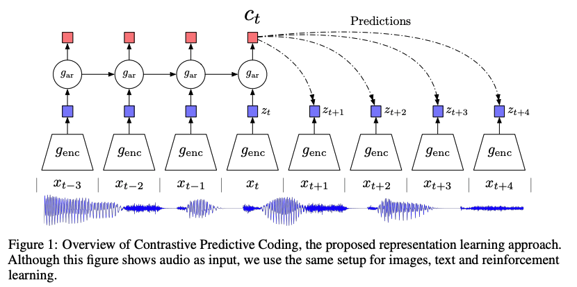
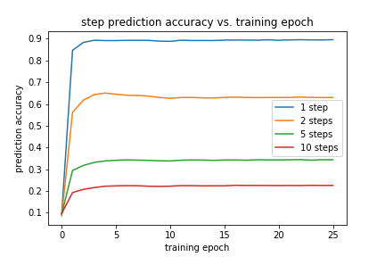

# Representation Learning with Contrastive Predictive Coding

### Overview

This is a minimal implementation of [Representation Learning with Contrastive Predictive Coding (CPC)](https://arxiv.org/abs/1807.03748) [1].

The paper experiments with representation learning for audio, vision, natural language, and reinforcement learning. Finding a good representation of data can greatly ease downstream prediction tasks. Word embeddings used in Natural Language Processing is just one example where stronger are directly responsible for breakthrough performance.

The implementation in this repo focuses on learning a representation for speech. The training data contains 100 hours of speakers reading books: [LibriSpeech](http://www.openslr.org/12).

The learning task for contrastive predictive coding is well summarized by figure 1 in the paper.



The encoder, $g_{enc}$, ingests a window of raw audio samples and outputs an embedding vector: $z_t$. An auto-regressive network, $g_{ar}$, is tasked with predicting future embeddings ($z_{t+1}$, $z_{t+2}$, ...) given previous embeddings ($z_{t}$, $z_{t-1}$, ...). At each time-step, the auto-regressive network outputs a context vector, $c_t$. Future time steps are predicted by applying a affine transformations to the context: $\hat{z}_{t+n}=f(c_t, \theta_n)$.

At first blush, it would seem sufficient to minimize some loss  $\mathcal{L}=\sum_{n=1}^{n=T} f(z_{t+n}, \hat{z}_{t+n})$. Unfortunately, the network will quickly learn to game the system by learning an encoder that trivially maps all inputs to the same vector. To resolve this problem, the authors introduces a "contrastive loss" [2]. The network is presented with lineup of examples: the true future steps and K distractor steps drawn from the same sequence.

To suceed at this discrimitive task - true next step vs. imposter next steps - the network must learn an embedding that is highly informative of future steps. By restricting the dimension of the encoding, the network should avoid wasting its limited resources on non-informative noise or redundant information.

### Implementation - models.py

**encoder (`genc_model`)**

- stack of 4 x Conv1D **causal** convolutions, ReLU activations
  - it is important that future information isn't leaked to the encoder
- receptive field 256 samples, stride 128 samples
- default output dimension (dim_z) = 40
- given a 1D audio input of length T, the output is 2D with shape (T // 256, dim_z)
  - for a 16ksample input and default settings this is a 2D image with shape: (62, 40)

**auto-regressive model (`ar_model`)**

- single-layer Recurrent NN (GRU)
- default context dimension (dim_c) = 40
- default GRU hidden units = dim_c = 40
- default prediction = 10 future time steps

**contrastive sampling (`GenTargets`)**

- 1 positive sample
- default negative samples = 10 (`num_neg`)
  - negative samples taken from within each time sequence
  - sampling with replacement (for implementation ease)
  - possible to grab positive examples (again, for implementation ease)
- important to `stop_gradient` from flowing through contrastive samples

**auto-regressive loss (`ARLoss`)**

- calculate dot-product similarity of $\hat{z}_{t+n}$ and true  $z_{t+n}^*$sampled $z_{t+n}$
- softmax of dot-product similarities, then cross-entropy loss

### Experimental Results

##### Training Setup

- Optimizer = Adam
- learning rate = 1e-3
- Training data: LibriSpeech
  - train: train-clean-100
  - validation: dev-clean
- Training regimen: 25 epochs, 1/3 LR decay at 10, 15, 20 epoch
- 10 negative (contrastive) samples
- predict 10 future steps
- $z_t \in \mathbb{R}^{40}$, $c_t \in \mathbb{R}^{40}$

##### Training Results

The below plot shows the auto-regressive model's prediction accuracy for 1, 2, 5, and 10 steps into the future. As one would expect, the accuracy decreases for steps further into the future. But, even at 10 steps into the future, the model beats random guessing (10% accuracy) by a factor of 2. We've defined a non-trivial auto-regressive task where the encodings contain information about the future evolution of the audio.



##### Is the Learned Representation Useful?

We used the [Google keyword dataset](https://www.kaggle.com/c/tensorflow-speech-recognition-challenge) to evaluate the performance of our CPC-trained speech encoder. This dataset contains ~1,000 x 1 second recordings of 30 different key words (about 8 hours of data). We compare the performance of our representation versus a log-mel spectrogram (the go-to encoding for speech / sound classification).

The keyword detection model can be found [TODO](here). Briefly, it is a stack of 3 x conv-conv-pool layers. All Conv2D layers use 3x3 kernels with batch normalization and a ReLU activation function. The final convolution is 3x3x30, followed by Global Average Pooling to generate 30 class logits.

The results are reasonably good, but substantially worse than the log-mel spectrogram baseline:

| Representation                            | Train Accuracy | Validation Accuracy |
| ----------------------------------------- | -------------- | ------------------- |
| log-mel spectrogram                       | 99.0%          | 95.2%               |
| random encoder                            | 74.0%          | 61.5%               |
| random encoder + supervised training      | 98.5%          | 92.7%               |
| CPC-trained encoder                       | 98.7%          | 90.5%               |
| CPC-trained encoder + supervised training | 98.8%          | 93.4%               |

**Table 1.** The random encoder uses the untrained Conv1D encoder network (`genc_model`) to process the audio samples. "+ supervised training" indicates the encoder network is trained on the supervised keyword spotting task.

We clearly learned a much better representation than a cascade of randomly initialized convolutions: 90.5% vs. 61.5% accuracy. This may seem like faint praise, but randomly initialized convolutions can surprisingly well. See, for example, [Deep Image Prior](https://arxiv.org/abs/1711.10925) [3]. But, unfortunately, we are better off directly training our encoder on the supervised task: 92.7% vs. 90.5% accuracy. And best off just using the spectrogram, which reaches an accuracy of 95.2%.

So, the learned encoder is much better than a randomly initialized decoder, but underperforms the log-mel spectrogram. Here are a couple possible reasons:

- The KWS classification network is a CNN and the log-mel spectrogram contains strong spatial structure. So the data and the network structure are well suited to each other. In contrast, the CPC-trained encoder feeds fully-connected layers in the GRU. The encoder and decode can cooperate to learn one of $dim_z !$ feature vector permutations - with most having no particular structure. 
- The KWS dataset is reasonably large, with 8 hours of data for our target task.

### Usage Instructions

1. Get [LibriSpeech data](http://www.openslr.org/12)

Download `dev-clean.tar.gz` and `train-clean-100.tar.gz`

Extract to your home directory:

```
<home>/Data/LibriSpeech/
    dev-clean/
    train-clean-100/
```

Note: There are more corrupted datasets available at LibriSpeech. It is probably worthwhile to train a representation with noisier and generally less clean recordings.

2. Create TFRecords files

```bash
python tfrecords.py dev-clean
python tfrecords.py train-clean-100
```

This will add a `tfrecords/` folder to the above `Data` directory.

3. Train the model

```bash
python train.py
```

`-h` to list training options.

4. The encoder weights are saved at the completion of training.

`outputs/genc.h5`

5. Now that we have a trained encoder, we can use it to extract a representation for other audio tasks. One possible application is pre-processing audio samples for keyword spotting. This [kws implementation](https://gitlab.analog.com/boston-garage/kws) is set up to use weights from this trained model.

### Requirements

```
tensorflow==2.x
numpy
soundfile
azureml     # optional - for logging on MSFT Azure ML infrastructure
```

### References

1. [Representation Learning with Contrastive Predictive Coding](https://arxiv.org/abs/1807.03748) (Aaron van den Oord, Yazhe Li, and Oriol Vinyals).
2. [Noise-contrastive estimation: A new estimation principle for unnormalized statistical models](http://proceedings.mlr.press/v9/gutmann10a/gutmann10a.pdf) (Michael Gutmann and Aapo Hyvarinen)
3. [Deep Image Prior](https://arxiv.org/abs/1711.10925) (Dmitry Ulyanov, Andrea Vedaldi, and Victor Lempitsky)